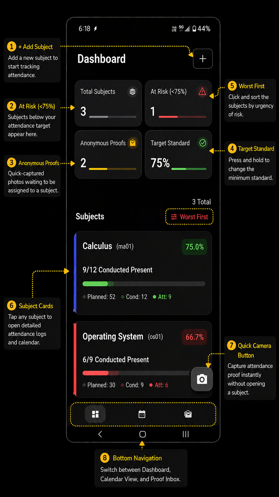
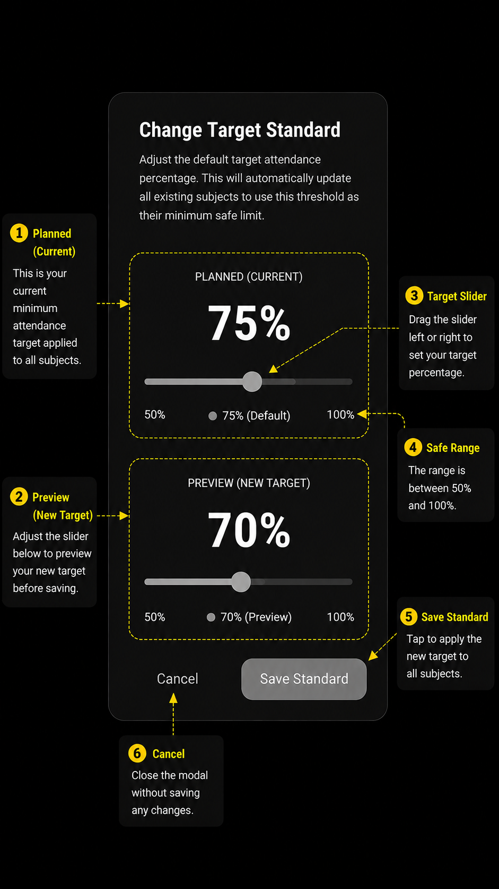
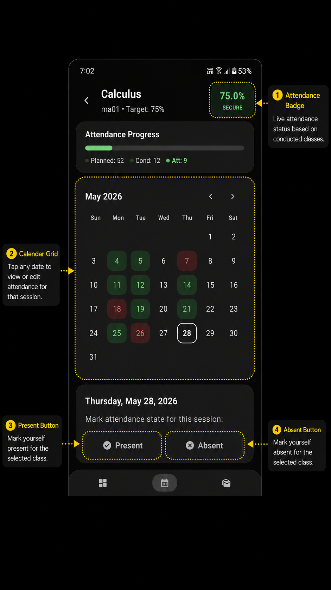
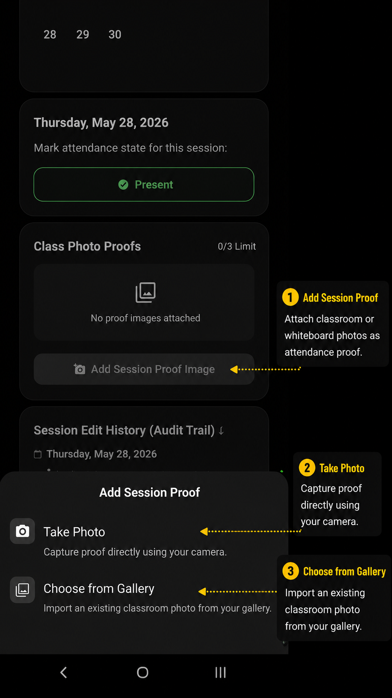
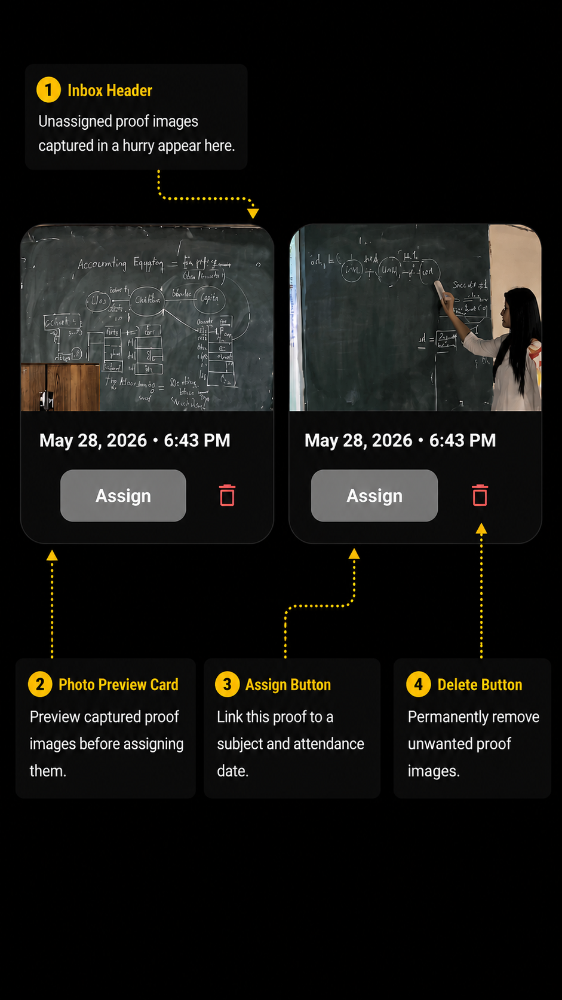

# Student Attendance Tracker 🎓

A modern, offline-first Flutter application designed for students to effortlessly track their class attendance, monitor risk levels, and securely store photographic proof of attendance. 

Crafted with a sleek, minimalist Charcoal Glassmorphism UI, this app ensures you never fall below your target attendance standard again.

## 📸 App Tour & Walkthrough

Here is a visual walkthrough of the key screens and features of the Attendance Tracker app as seen during the initial download guide:

### 1. Explore Dashboard


The central hub showing registered subjects, aggregate stats, risk status, anonymous proof count, and standard target limits.

### 2. Safety Standard


Keep your attendance above the safe limits (e.g. 75%). This screen details warning levels and minimum safe class counts.

### 3. Mark Your Attendance


Select dates on the calendar view to quickly log session details, attendance status (present/absent), and custom remarks.

### 4. Add Proofs for Convenience


Keep secure photographic proof of attendance by snapping pictures directly or choosing files from your gallery.

### 5. Assign Your Proof Accumulated in Hurry


Capture proofs in a hurry and categorize them later. Unassigned proof images are saved in the Anonymous Inbox for classification.

## ✨ Key Features

* **Real-time Analytics:** Instant breakdown of classes attended vs. conducted, ensuring your aggregate attendance stays above the target standard (e.g., 75%).
* **Visual Calendar Tracking:** A beautiful grid calendar view for each subject, making it easy to identify patterns in absences or present days.
* **Photo Proof Integration:** Snap photos directly within the app (or upload from gallery) to keep a secure, undeniable record of your presence for contested attendances.
* **Anonymous Inbox:** Quickly capture class photos on the fly without assigning them to a specific subject immediately, and categorize them later.
* **Audit Trail (Session History):** Maintains a detailed log of every modification made to a session, so you can track when a class was marked present, unmarked, or deleted.
* **Custom UI/UX:** Features a highly aesthetic "Charcoal Minimalist" dark theme built with glassmorphism cards and custom typography.
* **Offline First:** All data, including images, is saved directly to your device storage using robust local persistence mechanisms.

## 🛠️ Tech Stack

* **Framework:** [Flutter](https://flutter.dev/)
* **Language:** Dart
* **State Management:** Provider
* **Storage:** SharedPreferences (Settings) & local file system (Images / JSON persistence)
* **Media:** `image_picker`, `wechat_assets_picker`

## 🚀 Getting Started

### Prerequisites
* Flutter SDK (Latest stable version)
* Android Studio / VS Code
* An Android/iOS device or emulator

### Installation

1. **Clone the repository**
   ```bash
   git clone git@github.com:Nikhil-Verma22/attendance.git
   cd attendance
   ```

2. **Install dependencies**
   ```bash
   flutter pub get
   ```

3. **Run the application**
   ```bash
   flutter run
   ```

## 📁 Project Structure

```text
lib/
├── models/         # Data structures (Subject, ClassSession, ProofImage)
├── providers/      # Provider state management (AppState)
├── services/       # Core business logic (StorageService, AttendanceService)
├── ui/
│   ├── screens/    # Main application screens (Dashboard, Subject Detail)
│   ├── widgets/    # Reusable UI components (Glassmorphism cards, Calendar)
│   └── theme.dart  # Static theme definitions (Charcoal Minimalist)
└── main.dart       # App entry point
```

## 📝 License

This project is open-source and available under the [MIT License](LICENSE).
